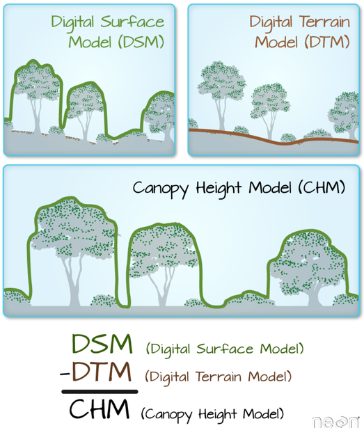

## Installation 

This repository makes use of 
1. Point Cloud Library (PCL) https://pointclouds.org
2. Cloth Simulation Filter (CSF) https://github.com/jianboqi/CSF


To use the pcd viewer, run this 

```
cd ~/pointclouds
./basics/build/pcl_viewer ~/pointclouds/data/cloud_out/...
```



